## Pasos que utilizamos para configurar nuestro sistema (windows 10/11)
Revisar si los puertos:  3306, 3308, 5000, 5001, 5100, 5200, 5201, 5202, 5672, 8088, 15672  estan desocupados, de lo contrario se deberan cerrar las aplicaciones que utilicen esos puertos, o cambiar los puertos utilizados para ejecutar cada aplicacion.   
  1.  Puerto 3306, 3308 Base de datos     
  2.  Puerto 5000 Frontend     
  3.  Puerto 5001 Collect     
  4.  Puerto 5100 Publisher-Backend     
  5.  Puerto 5200, 5201, 5202 Slaves    
  6.  Puerto 5672, 15672 RabbitMQ     
  7.  Puerto 8088 Nginx   
  
En caso de querer modificar configuraciones de la aplicacion, se debe acceder a los siguientes archivos:  
   1. Para cambiar la configuración de la conexión a la base de datos "boletería", se debe cambiar en el archivo Cluster1/Backend/config/config.json  
      1.1 Para cambiar la contraseña con la que se accede a la base de datos cambiar el parametro "pass", que se encuentra en "dbConnConfig1"  
      1.2 Para cambiar el usuario con el que se accede a la base de datos cambiar el parametro "user", que se encuentra en "dbConnConfig1"  
      1.3 Para cambiar el puerto por el que se accede a la base de datos cambiar el parametro "port", que se encuentra en "dbConnConfig1"  
      1.4 Para hacer efectivos los cambios y correrlos con docker, realizar los siguientes cambios en el archivo Cluster1/docker-compose.yml(Teniendo en cuenta que se realizo algún cambio en el archvio de configuración antes mencionado):  
         1.4.1 Si se cambio la contraseña en el archivo de configuracion, se tiene que cambiar tambien en la seccion MYSQL_ROOT_PASSWORD:  
            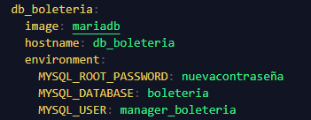   
         1.4.2 Si se cambio el usuario en el archivo de configuracion, se tiene que cambiar tambien en la seccion MYSQL_USER:    
            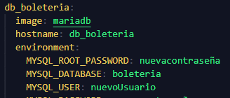  
         1.4.3 Si se realizo un cambio en el puerto por el cual correra la base de datos, tendra que cambiar el valor de ports:  
            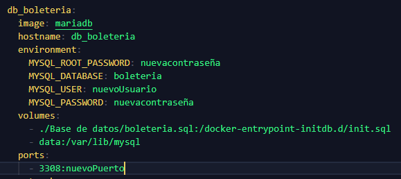  
   2. Para cambiar la configuración de la conexión a la base de datos "token", se deben cambiar los archivos:  
      2.1 Cluster1/Backend/config/config.json  
      2.2 Cluster2/Suscription-Backend/config/config.json  
      2.3 Cluster3/GarbageCollector/config/config.json  
      2.4 Cluster3/token_backend/config/config.json  por cada Slave añadido.  
      2.5 Todos estos archivos son los mismos en estructura, por ende solo tenemos que revisar el apartado de dbConnConfig, si se realiza un cambio en un archivo, hay que realizarlos en todos:  
      2.6 Para cambiar la contraseña con la que se accede a la base de datos cambiar el parametro "pass", que se encuentra en "dbConnConfig"  
      2.7 Para cambiar el usuario con el que se accede a la base de datos cambiar el parametro "user", que se encuentra en "dbConnConfig"   
      2.8 Para cambiar el puerto por el que se accede a la base de datos cambiar el parametro "port", que se encuentra en "dbConnConfig"  
      2.9 Para hacer efectivos los cambios y correrlos con docker, realizar los siguientes cambios en el archivo Cluster3/docker-compose.yml(Teniendo en cuenta que se realizo algún cambio en el archvio de configuración antes mencionado):  
         2.9.1 Si se cambio la contraseña en el archivo de configuracion, se tiene que cambiar tambien en la seccion MYSQL_ROOT_PASSWORD:  
            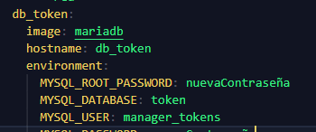  
         2.9.2 Si se cambio el usuario en el archivo de configuracion, se tiene que cambiar tambien en la seccion MYSQL_USER:  
            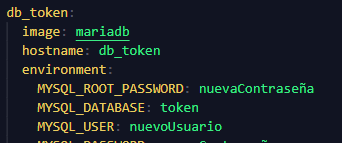  
         2.9.3 Si se realizo un cambio en el puerto por el cual correra la base de datos, tendra que cambiar el valor de ports:  
             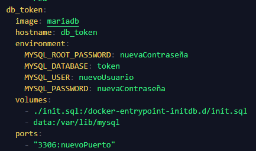  
   3. Para añadir nuevas colas primero se debe añadir el concierto a la base de dato con su respectiva cola. Luego se debe modificar:  
      3.1 Cluster2/Publisher-Backend/config/config.json
         3.1.1 Añadir la nueva cola con el nombre del concierto o conciertos que existiran en esta.  
              
         Aqui se añadio una nueva cola llamada "nuevacola"  
      3.2 Cluster2/Suscription-Backend/config/config.json  
         3.2.1 Luego de haber añadido en 3.1.1 añadir en la seccion "Queues" la cola con su capacidad de persoans que podran estar antes de que empiece a encolar.  
            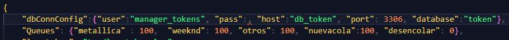  
         Aqui se añadio una nueva cola con una capacidad de 100 personas que pueden entrar, antes de empezar a encolar.
   4. Para añadir réplicas del componente token_backend:  
      4.1 Añadir el archivo de configuración correspondiente (ejemplo: config3.json).  
            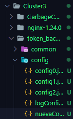  
      4.2 Modificar el archivo Cluster3/nginx.conf, añadiendo la ruta del slave en la sección "upstream backend".  
            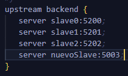  
      4.3 Añadir la información del slave a Cluster3/.env para que se ejecute al levantar con el "docker compose up".  
            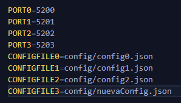  
            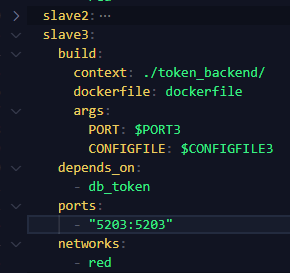  
   5. Para cambiar las credenciales de rabbitMQ:  
      5.1 Cambiar las variables de entorno (RABBITMQ_USER,RABBITMQ_PASSWORD) en Cluster2/rabbit/Dockerfile en los siguientes ejemplos se cambio el usuario y la contraseña.  
            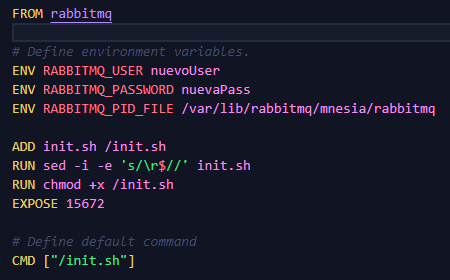  
      5.2 Cambiar Cluster1/Backend/config/config.json donde se establece la conexión a la cola.  
            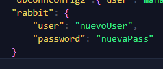  
      5.3 Cambiar Cluster2/Publisher-Backend/config/config.json, donde se establece la conexión a la cola.  
            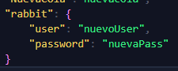  
      5.4 Cambiar Cluster2/Suscription-Backend/config/config.json, donde se establece la conexión a la cola.  
            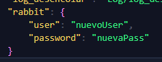  
      5.5 Cambiar Cluster3/GarbageCollector/config/config.json, donde se establece la conexión a la cola.  
            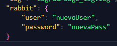  
      5.6 Cabe destacar que al cambiar una credencia, ya sea user o password, esta tiene que cambiar en todos los archivos antes mencionados.
   6. Para cambiar la cantidad de clientes simultáneos en conciertos con la misma cola, se debe cambiar en  Cluster2/Suscription-Backend/config/config.json
           
